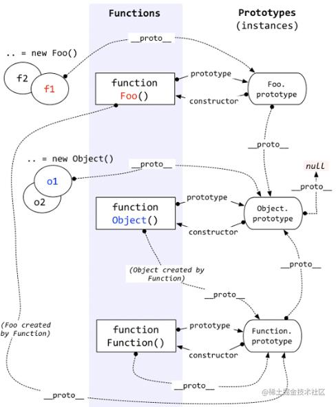
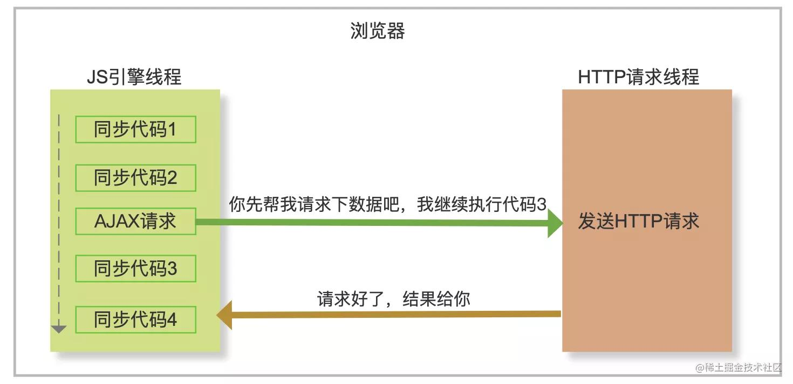
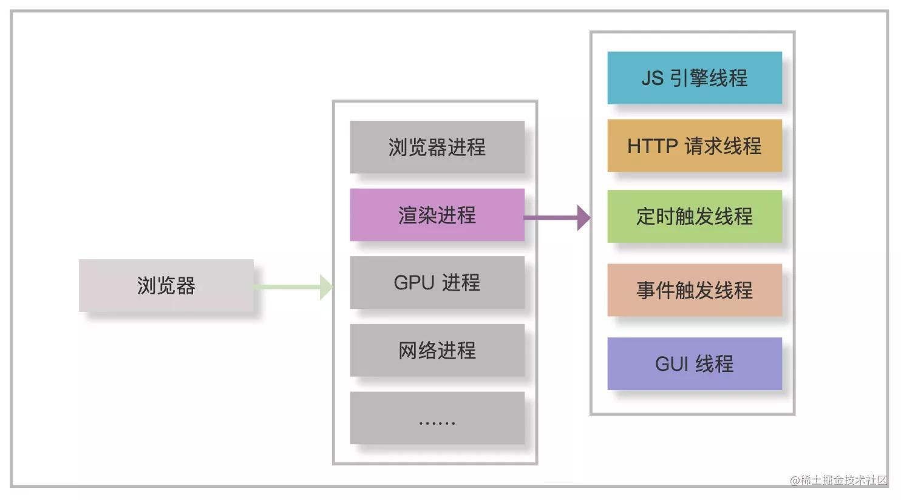
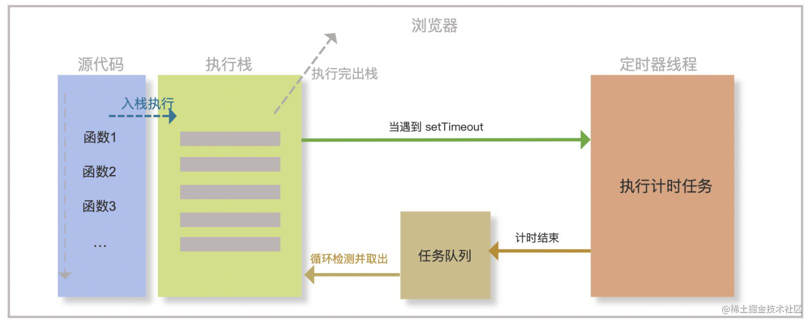

# JavaScript 核心

## 作用域

- 全局作用域
- 函数作用域
  - 执行上下文
  - 词法作用域
- 块级作用域
- 闭包
  - 有权访问另一个函数作用域中变量的函数。
  - 通常用于保存函数内部状态，创建私有变量。
  - 实现一些高级编程技巧，比如函数科里化、事件委托、惰性求值。
- 作用域链
  - 作用域链是一个变量查找机制。
  - js 引擎需要查找一个变量时，它会先在当前执行上下文中查找，如果找不到，则向上遍历作用域链，直到全局执行上下文为止。

## 原型链

一个实例对象在调用属性和方法的时候，会依次从实例本身，构造函数的原型、构造函数的原型的原型...查找是否有对应的方法和属性。
这种查找方式就好像一个链条一样，专业上称之为原型链。



## 事件循环

### 浏览器异步执行原理
**js 是单线程，也就是说同一时刻只能做一件事情。**
浏览器是多线程的，当 js 需要执行异步任务时，浏览器会开启另外一个线程去执行该任务。



浏览器有多个进程，如渲染进程，GPU进程，网络进程等。每一个 tab 页都是一个渲染进程。
**渲染进程主要包括了 JS引擎线程、HTTP请求线程、定时器线程等。这些线程为 js 在浏览器中完成异步任务提供了基础。**



### 事件驱动浅析
浏览器异步任务的执行原理背后其实是一套事件驱动的机制。事件触发、任务选择和任务执行都是由事件驱动机制完成的。
**事件循环其实是在事件驱动模式中管理和执行事件的一套流程。**

### 执行栈和任务队列
JS 在执行的时候会把同步代码放到执行栈中，然后依次执行函数。当遇到异步任务时就交给其它线程去处理，待当前执行栈所有的同步代码执行完毕后
会从一个队列中去取出已完成的异步任务的回调加入执行栈中继续执行。

JS 按顺序执行执行栈中的方法。每次执行一个方法时，会为这个方法生成独有的执行环境(上下文 context)，待这个方法执行完毕后，销毁当前的执行环境
并从栈中弹出此方法。继续执行下一个方法



事件驱动模式下，至少包含一个执行循环去检测任务队列是否有新的任务。不断的循环去取异步任务的回调来执行，
这个过程就是事件循环，每一次循环就是一个事件周期或称为一次 tick。

### 宏任务和微任务
任务队列不止一个，根据任务种类不同，可分为微任务队列和宏任务队列。

事件循环的过程中，执行栈在同步代码执行完成后，优先检查微任务队列是否有任务执行，如果没有，再去宏任务队列检查是否有任务执行，如此反复。
**微任务一般比宏任务先执行，并且微任务队列只有一个，宏任务队列可能有多个。**
#### 常见宏任务
* setTimeout()
* setInterval()
* setImmediate()

#### 常见微任务
* promise.then()
* new MutationObserver()
* process.nextTick()

宏任务与微任务的区别

* **宏任务：** 有明确的异步任务需要执行和回调，需要其它异步线程支持。
* **微任务：** 没有明确的异步任务需要执行，只有回调，不需要其他异步线程支持。

```js
setTimeout(() => {
  console.log(5)
  new Promise((resolve) => {
    console.log(6)
    resolve()
  }).then(() => {
    console.log(8)
  })
  console.log(7)
}, 0)
function promise2() {
  return new Promise((resolve) => {
    console.log(2)
    resolve()
  })
}
async function async1() {
  console.log(1)
  await promise2()
  console.log(4)
}
async1()
console.log(3)
```
## 垃圾回收

## 事件
